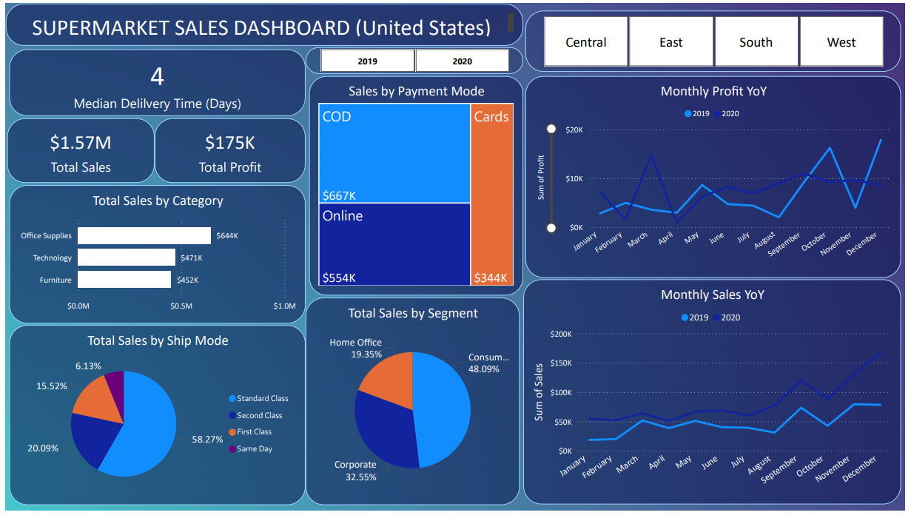

# Supermarket Performance & Profitability Analytics (Power BI)
## Project Background
This project analyzes a mid-scale supermarket retailer operating in the fast-moving consumer goods (FMCG) industry. The business follows a high-volume, low-margin retail model, offering products across Office Supplies, Technology, and Furniture categories. The dataset spans two financial years (2019–2020) and captures order-level transactions, delivery timelines, regional performance, and profitability metrics.

From the perspective of a business data analyst working within the organization, the objective of this project was to evaluate whether sales growth translated into sustainable profitability, identify regional and category-level efficiency gaps, and surface risks related to cost, discounting, and operational performance. The dashboard was designed to support strategic decisions across sales planning, regional expansion, and margin optimization.

### **Insights and recommendations are provided across the following key areas:**

- **Overall Sales & Profit Performance**

- **Regional Efficiency Analysis**

- **Category Contribution & Mix**

- **Time-based Profitability Trends**

An interactive **Power BI dashboard** was built using **Power Query** for data transformation and **DAX** for advanced metric calculation. 

### Useful Links: 

**You can downloaded the interactive Power BI Dashboard** [HERE](https://github.com/rahulkhandareDA/SuperMarket-Performance-Analytics-Using-Power-BI/blob/main/Supermarket%20Performance%20Analytics.pbix)

## Data Structure & Initial Checks

The analysis is based on a single consolidated fact table named Supermarket_data, containing 5,901 rows of transactional records. Rather than a multi-table warehouse, this dataset represents a flattened structure combining order, customer, product, and logistics attributes in one table.

**Columns included in the dataset:**

- Order & Shipping: Order ID, Order Date, Ship Date, Ship Mode, AvgDelivery
- Sales Metrics: Sales, Profit, Quantity, Returns
- Customer Attributes: Customer ID, Customer Name, Segment, Payment Mode
- Product Attributes: Product ID, Product Name, Category
- Geography: Country, Region, State, City
- System Fields: Row ID

**All data was imported, cleaned, and transformed using Power Query, where the following steps were performed:**

- Data type standardization for dates and numeric fields

- Creation of delivery duration metrics from order and ship dates

- Handling of missing and inconsistent categorical values

- Validation of negative profit and return records

- Removal of duplicate rows and invalid entries

**The cleaned dataset was then loaded into Power BI, where DAX measures were created on top of this single-table model to compute KPIs, trends, and forecasts.**

## Executive Summary

Over the two-year period, the supermarket generated **1.57M** in total sales, but only **175K** in profit, resulting in an overall profit margin of **~11.1%**. While sales increased by nearly **79%** year-over-year, profit grew by only **12%**, indicating that revenue growth did not **scale proportionally with profitability**. Regional and category-level disparities reveal clear **opportunities to improve margin efficiency and cost control**.

## Insights Deep Dive

### Overall Business Performance

- Over the two-year period, the supermarket generated **1.57M** in total sales and **175K** in profit, resulting in an overall profit margin of **~11.1%**, **highlighting the thin-margin nature of the business**.

- Sales increased from **0.56M in 2019 to 1.0M in 2020 (~79% YoY growth)**, while profit grew **only from 83K to 93K (~12% growth)**, indicating that revenue growth did not scale proportionally with profitability.

### Regional Performance & Efficiency

- The **West region emerged as the strongest performer**, contributing 0.52M in sales (33% of total) and 68K in profit **(39% of total)**, making it the most operationally efficient region.

- The **Central region** generated 0.34M in sales (22%) but only 27K in profit (15%), **suggesting margin inefficiencies**.

- Despite **lower sales** of 0.25M (16%), the **South region** matched Central’s profit at 27K, indicating **higher profit per unit sold** and better margin control.

### Category Mix & Revenue Contribution

- **Office Supplies** was the dominant category, contributing 644K in sales **(~41% of total revenue)**.

- Technology and Furniture together accounted for the remaining ~59% of sales, presenting opportunities to optimize category mix toward higher-margin products.

### Time-Based Profitability Trends

- In October 2019, profit dropped sharply to $383, and in October 2020, the business recorded a ~2K loss, indicating recurring operational or pricing challenges during this period.

- March 2020 delivered 14K in profit, with the West region contributing ~64% (9K), reinforcing its strategic importance.

- **December sales more than doubled YoY**, rising from 78K in 2019 to 166K in 2020 (~113% growth). However, **profit declined from 18K to 8K**, clearly signaling **margin erosion** during peak seasonal demand.

### Sales Forecast (Q1 2021)

- Based on the strong upward trend observed in Q4 2020, projected sales are 146K in January 2021, 150K in February 2021, and 154K in March 2021.

- This represents a **~5.5% growth across Q1 2021**, supporting proactive inventory, staffing, and sales planning decisions.

**You can see the forecast visual here:**

## Recommendations

Based on the insights above, the following actions are recommended for leadership and strategy teams:

- **Prioritize margin optimization over pure sales growth**, especially in high-volume categories.

- **Replicate West region** best practices across Central and South regions to improve efficiency.

- Review discount and cost structures during peak months to prevent profit erosion.

- **Rebalance product focus toward higher-margin sub-categories** rather than revenue-heavy but low-margin items.

- Use time-based trend monitoring to proactively flag months with recurring profitability risks.

## Assumptions & Caveats

- **COVID-19 impacts** in 2020 were inferred based on timing and trends; no external data was merged.

- Profit analysis assumes reported costs are accurate and stable across regions.

- Outlier months were retained to reflect real business volatility.

- Delivery performance analysis assumes shipment and order dates were correctly recorded.

